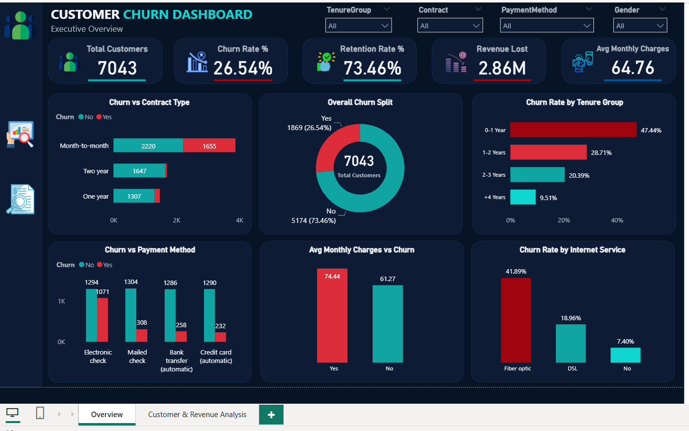
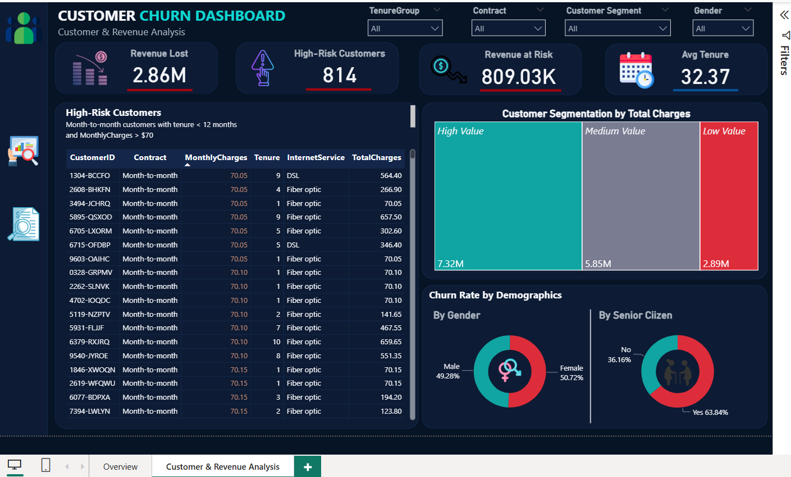

# 📊 Customer Churn Analysis Dashboard

## 📌 Project Overview

Customer churn is one of the most critical challenges for subscription-based businesses. Losing customers directly impacts revenue, profitability, and long-term growth.

This project provides an end-to-end customer churn analysis solution using **SQL Server**, **Python**, and **Power BI** to identify churn patterns, analyze customer behavior, estimate revenue impact, and support data-driven retention strategies.

The analysis focuses on understanding:

- Why customers leave
- Which customer segments are most likely to churn
- How churn affects revenue
- Which factors contribute most to customer retention
- Which customers should be targeted by retention campaigns

---

## 🎯 Business Problem

Customer acquisition is expensive, making customer retention a top business priority.

The company needs to answer several key questions:

- What is the current churn rate?
- Which customers are most likely to leave?
- How do contract types influence churn?
- Does pricing affect customer retention?
- Which services help reduce churn?
- What revenue is currently at risk?

This dashboard was developed to provide actionable insights that support customer retention and revenue protection strategies.

---

## 🛠️ Tools & Technologies

### Data Processing & Analysis
- SQL Server
- Python
- Pandas
- NumPy

### Data Visualization
- Power BI
- DAX

### Python Libraries
- Matplotlib
- Seaborn

---

## 📂 Project Workflow

### 1️⃣ Data Preparation
- Data cleaning
- Handling missing values
- Data validation
- Data type conversion

### 2️⃣ SQL Analysis
- Customer segmentation
- Churn analysis
- Revenue analysis
- Contract analysis
- Service usage analysis
- Window functions
- Common Table Expressions (CTEs)

### 3️⃣ Python Exploratory Data Analysis
- Univariate analysis
- Bivariate analysis
- Customer behavior analysis
- Churn driver identification
- Business insights generation

### 4️⃣ Power BI Dashboard Development
- KPI creation
- DAX measures
- Interactive dashboards
- Executive reporting
- Business storytelling

---

# 📈 Dashboard Pages

---

## Page 1 — Executive Overview

Provides a high-level overview of customer churn performance.

### Key KPIs

- Total Customers
- Churn Rate %
- Retention Rate %
- Revenue Lost
- Average Monthly Charges

### Analysis Included

- Churn vs Contract Type
- Churn Rate by Tenure Group
- Churn Rate by Internet Service
- Churn vs Payment Method
- Monthly Charges vs Churn

### Key Objective

Identify the primary factors driving customer churn.

---

## Page 2 — Customer & Revenue Analysis

Focuses on customer value, revenue impact, and retention opportunities.

### Key KPIs

- Revenue Lost
- Revenue At Risk
- High-Risk Customers
- Average Tenure

### Analysis Included

- High-Risk Customer Identification
- Customer Segmentation
- Revenue Exposure Analysis
- Demographic Analysis
- Customer Value Assessment

### Key Objective

Support retention strategy development and prioritize high-value customers.

---

# 📊 Key Insights

### Contract Type

- Month-to-month customers exhibit the highest churn rate.
- Long-term contracts significantly improve retention.

### Customer Tenure

- Customers in their first year are the most vulnerable to churn.
- Churn risk decreases as tenure increases.

### Pricing Impact

- Customers with higher monthly charges are more likely to churn.
- Pricing appears to be a significant churn driver.

### Internet Service

- Fiber optic customers show higher churn rates than DSL customers.
- Service quality and customer expectations may influence retention.

### Support Services

- Customers with Tech Support and Online Security services churn less frequently.
- Value-added services contribute positively to customer retention.

### Revenue Risk

- High-value customers contribute a significant portion of revenue exposure.
- Retention efforts should prioritize high-value customer segments.

---

# 💡 Business Recommendations

### 1. Promote Long-Term Contracts
Encourage customers to move from month-to-month plans to annual or multi-year contracts.

### 2. Improve Customer Onboarding
Focus on the first 12 months of the customer journey to reduce early churn.

### 3. Enhance Support Services
Increase adoption of Tech Support and Online Security services.

### 4. Optimize Pricing Strategy
Review pricing structures and identify opportunities to improve perceived customer value.

### 5. Implement Retention Campaigns
Develop targeted retention initiatives for high-risk customer segments.

### 6. Monitor Revenue At Risk
Track high-risk, high-value customers and proactively engage them before churn occurs.

---

# 📈 KPIs Developed

- Total Customers
- Churned Customers
- Retained Customers
- Churn Rate %
- Retention Rate %
- Total Revenue
- Revenue Lost
- Revenue At Risk
- Average Monthly Charges
- Average Customer Value
- Average Tenure
- High-Risk Customers

---

# 📷 Dashboard Preview

## Executive Overview

---

## Customer & Revenue Analysis

---

# 🧠 Skills Demonstrated

### Data Analysis
- Exploratory Data Analysis (EDA)
- Customer Analytics
- Revenue Analysis
- Churn Analysis

### SQL
- Joins
- Aggregations
- Window Functions
- CTEs
- Business Query Development

### Python
- Data Cleaning
- Data Transformation
- Visualization
- Business Insight Generation

### Power BI
- Dashboard Design
- Data Modeling
- DAX Measures
- KPI Development
- Interactive Reporting

### Business Intelligence
- Executive Reporting
- Customer Segmentation
- Revenue Impact Analysis
- Data Storytelling
- Strategic Recommendations

---

# 🚀 Business Impact

This project enables decision-makers to:

- Understand churn behavior
- Identify high-risk customers
- Quantify revenue exposure
- Improve retention strategies
- Make data-driven business decisions

By combining SQL, Python, and Power BI, the solution delivers a comprehensive view of customer retention performance and provides actionable insights for reducing churn and protecting revenue.

---

## 👨‍💻 Author

### Mansour Meshwady

**Data Analyst | Business Intelligence Enthusiast**

- SQL Server
- Python
- Power BI
- Excel
- Tableau

📧 Email: mansourmishwady@gmail.com

🔗 LinkedIn: https://www.linkedin.com/in/mansour-meshwady-4ab5a027b

---

⭐ If you found this project useful, feel free to star the repository.
